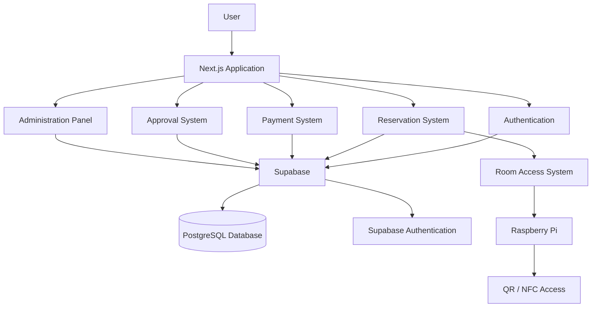
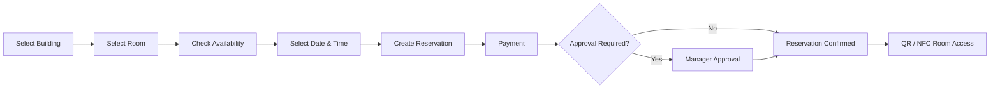

<div align="center">

# DeskHere

### Smart Meeting Room Reservation & Access Management Platform

A full-stack meeting room reservation platform developed during my internship at **Creditwest Bank**.

<br>


</div>

---

## About the Project

**DeskHere** is a smart meeting room reservation and access management platform designed to simplify the complete meeting room workflow.

Users can view room availability, create reservations, complete payments, track approval status, and access meeting rooms through QR/NFC-based systems.

Administrators can manage buildings, floors, rooms, maintenance periods, reservations, and approval processes from a centralized platform.

---

## Features

| Feature                  | Description                                    |
| ------------------------ | ---------------------------------------------- |
| Calendar Reservations    | Weekly calendar-based reservation system       |
| Real-Time Availability   | Live room availability and conflict prevention |
| Building Management      | Multiple buildings, floors and rooms           |
| Approval Workflow        | Manager approval / rejection system            |
| Payment Flow             | Dynamic pricing and payment status management  |
| Maintenance              | Disable rooms during maintenance periods       |
| Interactive Floor Plan   | Visual room availability on building layouts   |
| Reservation History      | Users can view their previous reservations     |
| QR / NFC Access          | Smart physical room access workflow            |
| Raspberry Pi Integration | Prototype electronic door-lock system          |

---

## User Roles

| Role           | Permissions                         |
| -------------- | ----------------------------------- |
| **Super User** | Full system and building management |
| **Manager**    | Reservation approval and management |
| **User**       | Room discovery and reservation      |

---

## Tech Stack

### Frontend


### Backend & Database


### Hardware


---

## System Architecture



---

## Reservation Flow



---

## Main Modules

### Reservation System

* Weekly reservation calendar
* Reservation conflict detection
* Dynamic reservation duration
* Real-time room availability
* Mobile-friendly calendar interface

### Payment System

* Dynamic price calculation
* Reservation-based payment records
* 5-minute payment timeout
* Pending / approved payment states
* Wallet / credit infrastructure

### Approval System

* Pending reservation requests
* Manager approval and rejection
* Reservation status tracking
* User feedback and notifications

### Maintenance Management

* Temporary room deactivation
* Maintenance periods displayed on calendar
* Reservation prevention during maintenance

### Smart Access

* QR-based access workflow
* NFC integration concept
* Raspberry Pi controlled door-lock prototype

---

## Database

The PostgreSQL database stores information related to:

| Entity       | Purpose                             |
| ------------ | ----------------------------------- |
| Users        | Authentication and user information |
| Buildings    | Building management                 |
| Floors       | Floor organization                  |
| Rooms        | Meeting room information            |
| Reservations | Reservation records                 |
| Payments     | Payment information                 |
| Approvals    | Reservation approval workflow       |
| Maintenance  | Room maintenance periods            |
| Features     | Room features and capabilities      |
| Access       | Room access permissions             |

---

## Screenshots

> Application screenshots can be added here.

<div align="center">

### Room Details


<br>

### Reservation Calendar


<br>

### Approval Management


</div>

---

## Getting Started

### 1. Clone the repository

```bash
git clone <repository-url>
cd DeskHere
```

### 2. Install dependencies

```bash
npm install
```

### 3. Configure environment variables

Create a `.env.local` file:

```env
NEXT_PUBLIC_SUPABASE_URL=your_supabase_url
NEXT_PUBLIC_SUPABASE_ANON_KEY=your_supabase_anon_key
```

### 4. Start the development server

```bash
npm run dev
```

Then open:

`http://localhost:3000`

---

## Project Goals

DeskHere aims to provide a centralized system where employees can quickly discover and reserve available meeting rooms while administrators can manage the entire reservation infrastructure.

The project also explores the integration between modern web applications and physical access-control systems using:

**Next.js · Supabase · PostgreSQL · Raspberry Pi · QR · NFC**

---

## Internship Context

This project was developed during my **40-working-day internship at Creditwest Bank**.

My work included:

* Frontend development
* Backend integration
* Database design
* Reservation logic
* Payment workflows
* Approval systems
* Responsive UI development
* Supabase integration
* PostgreSQL database operations
* Raspberry Pi hardware/software integration

---

## Future Improvements

* Real NFC-based door access
* Dynamic QR code generation
* Real payment gateway integration
* Email and push notifications
* Advanced analytics dashboard
* Google / Outlook Calendar integration
* Smart room recommendations
* Improved mobile experience

---

## Author

<div align="center">

### Ceren Yıldırım

Software Engineering Student

</div>

---

<div align="center">

Developed during my internship at **Creditwest Bank**

</div>
