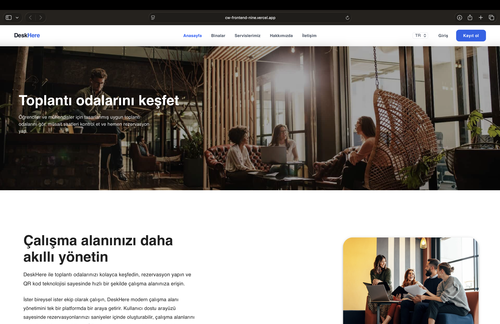
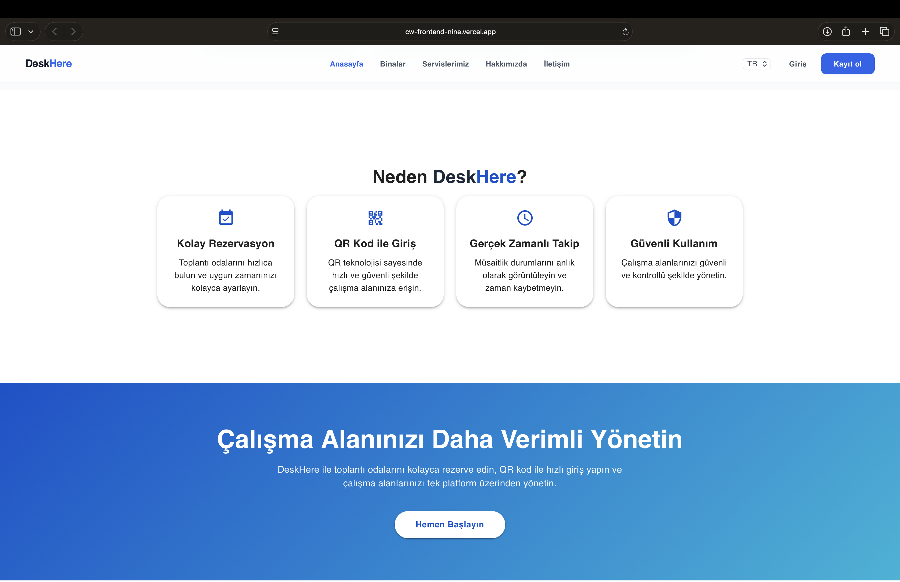
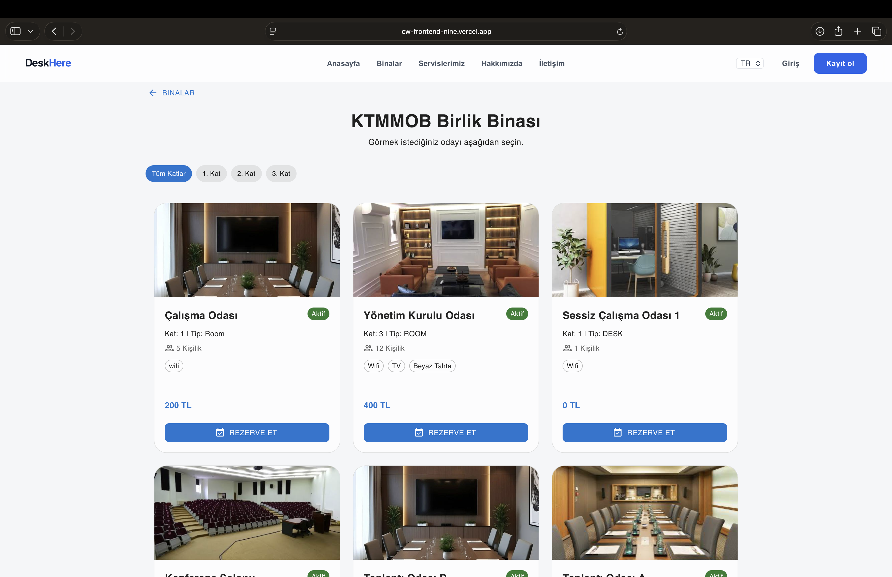
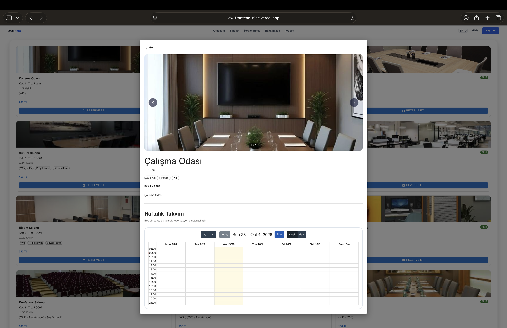
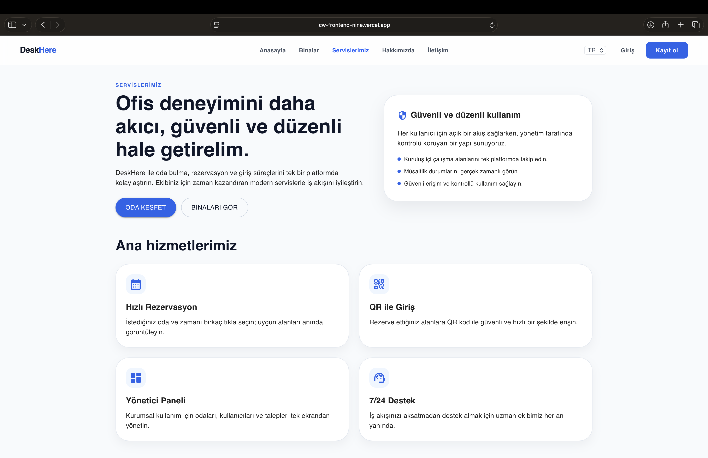
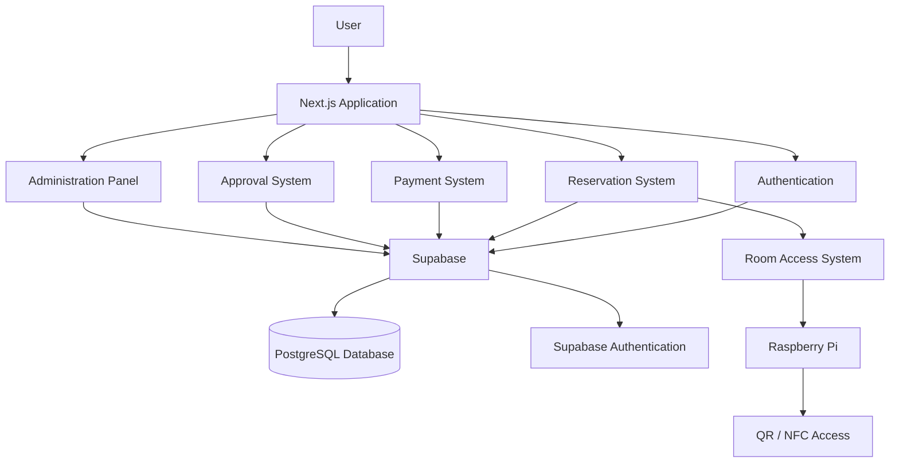
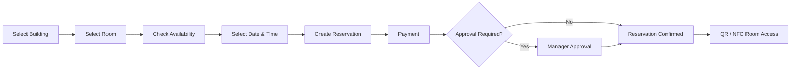

<div align="center">

# DeskHere

### Smart Meeting Room Reservation & Access Management Platform

A full-stack meeting room reservation platform developed during my internship at **Creditwest Bank**.

<br>


</div>

---

## About DeskHere

**DeskHere** is a smart meeting room reservation and access management platform designed to simplify the entire meeting room booking process.

Users can discover available locations and rooms, view room details, make reservations, follow approval processes, manage payments, and access meeting rooms through QR/NFC-based systems.

Administrators can manage buildings, floors, rooms, reservations, maintenance periods, approval workflows, and room availability from a centralized platform.

---

## Features

| Feature | Description |
|---|---|
| Room Reservations | Calendar-based meeting room reservation |
| Real-Time Availability | Live room availability and conflict prevention |
| Multi-Building Support | Buildings, floors and room management |
| Room Details | Capacity, services, images and room information |
| Approval Workflow | Manager approval and rejection system |
| Dynamic Pricing | Reservation duration-based pricing |
| Payment Management | Payment and reservation status tracking |
| Maintenance Management | Temporarily disable unavailable rooms |
| Interactive Floor Plans | Visual representation of room availability |
| Reservation History | Users can view their reservations |
| QR / NFC Access | Smart physical room access workflow |
| Raspberry Pi Integration | Prototype electronic door-lock system |

---

# Application Preview

## Main Page

<div align="center">
  
</div>

<br>

<div align="center">
  
</div>

---

## Locations

Users can browse available buildings and locations before selecting a meeting room.

<div align="center">
  
</div>

---

## Room Details

Each room includes information such as capacity, available services, images, availability and reservation options.

<div align="center">
  
</div>

---

## Services

DeskHere provides information about available meeting room services and facilities.

<div align="center">
  
</div>

---

# User Roles

DeskHere includes three main user roles:

| Role | Permissions |
|---|---|
| **Super User** | Full system administration and infrastructure management |
| **Manager** | Reservation approval and management |
| **User** | Room discovery, reservation and reservation management |

---

# Tech Stack

## Frontend


## Backend & Database


## Hardware Integration


---

# System Architecture



---

# Reservation Flow



---

# Main Modules

## Reservation System

- Weekly calendar-based reservation system
- Real-time room availability
- Reservation conflict prevention
- Dynamic reservation duration
- Mobile-friendly calendar interface
- Personal reservation history

## Building & Room Management

- Multiple building support
- Floor-based organization
- Room capacity information
- Room image galleries
- Room services and features
- Interactive floor plans
- Live room availability

## Approval System

- Pending reservation requests
- Manager approval and rejection
- Reservation status tracking
- User notifications

## Payment System

- Dynamic price calculation
- Reservation-based payment records
- Payment status management
- 5-minute payment timeout
- Pending and approved states
- Wallet / credit infrastructure

## Maintenance Management

- Temporary room deactivation
- Maintenance periods displayed on the calendar
- Reservation prevention during maintenance periods

## Smart Room Access

- QR-based access workflow
- NFC integration concept
- Raspberry Pi-based door lock prototype
- Physical room access integration

---

# Database

DeskHere uses **Supabase PostgreSQL** as its main database infrastructure.

The system manages data related to:

| Entity | Purpose |
|---|---|
| Users | Authentication and user information |
| Buildings | Building information |
| Floors | Floor organization |
| Rooms | Meeting room information |
| Reservations | Reservation records |
| Payments | Payment information |
| Approvals | Reservation approval workflow |
| Maintenance | Room maintenance periods |
| Features | Room services and capabilities |
| Access | Room access permissions |

---

# Getting Started

## 1. Clone the Repository

```bash
git clone <repository-url>
cd DeskHere
```

## 2. Install Dependencies

```bash
npm install
```

## 3. Configure Environment Variables

Create a `.env.local` file in the project root.

```env
NEXT_PUBLIC_SUPABASE_URL=your_supabase_url
NEXT_PUBLIC_SUPABASE_ANON_KEY=your_supabase_anon_key
```

> Never commit your real environment variables or credentials to GitHub.

## 4. Start the Development Server

```bash
npm run dev
```

Open:

`http://localhost:3000`

---

# Project Goals

DeskHere was designed to create a centralized system where employees can easily discover and reserve available meeting rooms while administrators can manage the reservation infrastructure from a single platform.

The project also explores the integration between modern web applications and physical access-control systems using:

**Next.js · React · TypeScript · Supabase · PostgreSQL · Raspberry Pi · QR · NFC**

---

# Internship Context

This project was developed during my **40-working-day internship at Creditwest Bank**.

My work on the project included:

- Frontend development
- Backend integration
- Database design
- Reservation logic
- Payment workflows
- Approval systems
- Responsive user interfaces
- Supabase integration
- PostgreSQL database operations
- Raspberry Pi hardware/software integration

---

# Future Improvements

- Real NFC-based door access
- Dynamic QR code generation
- Real payment gateway integration
- Email and push notifications
- Advanced analytics dashboard
- Google Calendar integration
- Outlook Calendar integration
- Smart room recommendations
- Improved mobile experience

---

# Author

<div align="center">

### Ceren Yıldırım

Software Engineering Student

<br>

Developed during my internship at **Creditwest Bank**

</div>
